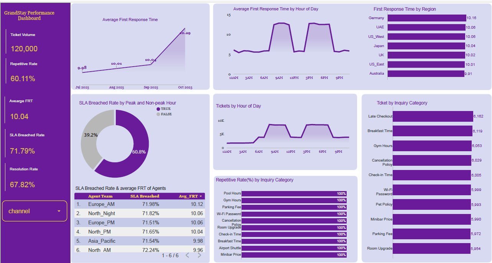
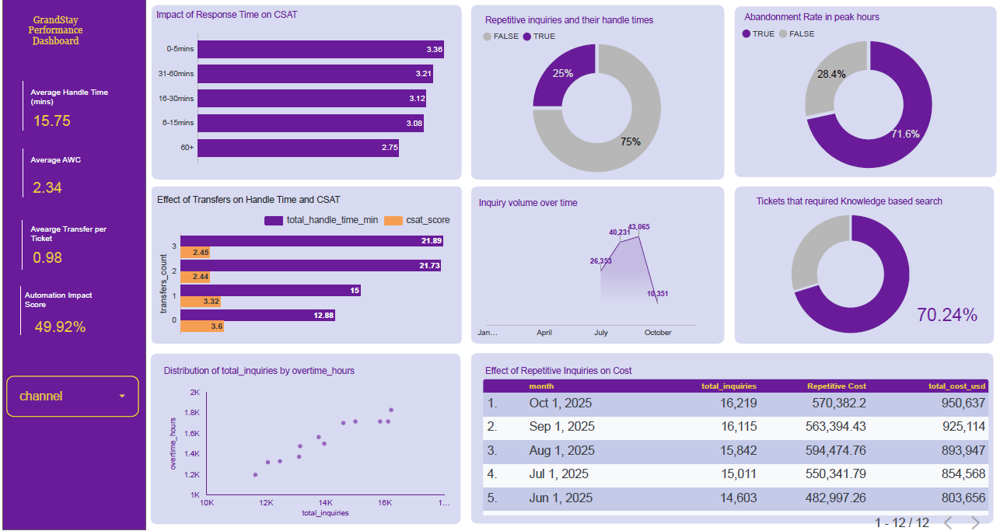

## Hospitality Operations Intelligence Initiative – Highlighting Analytics For Operational Optimization

## Project Description

This is a data‑driven analytics project focused on solving declining performance in guest support operations. Guest inquiry volumes were increasing faster than the existing support model could scale, resulting in long response times, high SLA breach rates, rising costs, and declining guest satisfaction.
Through analysis of support tickets, response times, resolution rates, and inquiry patterns, the project identified that over 60% of guest requests were repetitive and automation‑ready. Peak‑hour demand and manual workflows were the primary drivers of inefficiency and service degradation.
The project proposes an Intelligent Travel Concierge to automate routine inquiries, reduce response times, improve first‑contact resolution, and lower operational costs—transforming guest support into a scalable, analytics‑led operation that improves both customer experience and business efficiency.

---
## Project Overview
GrandStay Hospitality Group operates over 8,000 properties across 130 countries, supporting guests across luxury, business, and extended‑stay segments. As guest expectations shifted toward always‑on, digital‑first service, the existing support model struggled to scale. Rising inquiry volumes, repetitive requests, peak‑hour SLA breaches, and inconsistent knowledge handling exposed structural inefficiencies in global guest operations.
This project was designed to provide leadership with data‑backed clarity on whether automation could sustainably resolve these challenges.
Using enterprise operational data, the project establishes a baseline across time, scale, and cost, measuring response delays, SLA reliability, repetitive inquiry volume, and cost per contact. These insights are translated into a clear financial and operational case for automation.
The outcome is an analytics framework and executive dashboard that quantifies bottlenecks, models pre‑ and post‑automation impact, and enables leadership to confidently evaluate the ROI of deploying an Intelligent Travel Concierge—grounding automation decisions in measurable KPIs, cost savings, and scalability projections.

---
## Rationale for the Project
Leadership requires objective, defensible evidence before investing in AI-driven automation. The initiative was launched to:

- Validate the existence and magnitude of operational bottlenecks

- Establish pre-automation baselines

- Quantify financial impact of inefficiencies

- Define measurable success metrics for post-deployment evaluation

The project ensures that automation decisions are supported by data, not assumptions

---
## Project Objective:
Develop a data-driven operational baseline and measurement framework to justify and evaluate the Intelligent Travel Concierge initiative.

Specific Objectives:
- Quantify Time, Scale, and Cost inefficiencies
- Identify automation-ready repetitive inquiries
- Measure SLA reliability and service consistency
- Model cost savings and revenue recovery potential
- Design a pre/post performance evaluation structure

---
## Project Scope
- Operational KPI definition and benchmarking
- Time, Scale, and Cost bottleneck quantification
- Repetitive inquiry analysis
- Cost and revenue impact modeling
- Dashboard creation (baseline & pilot evaluation)
- Pre/post automation measurement framework

## Project Image
 

## Interactive Dashboard
Click below to interact with the dashboard

[View Dashboard here](https://lookerstudio.google.com/s/kLsmTmB7qxY)

## Dataset
[Find the dataset here](./Dataset/)
## Key Insights
- Guest satisfaction is primarily driven by response time, with sharp CSAT decline beyond 60 minutes.
- Over 70% of tickets breach SLAs due to peak‑hour congestion and non‑scalable staffing models.
- ~60% of guest inquiries are repetitive and automation‑ready, consuming disproportionate support capacity.
- Manual workflows and ticket transfers reduce first‑contact resolution to 67.82% and increase cost per contact.
- Automation presents a clear path to improve speed, reliability, and scalability without linear cost growth.

## Projected Operational Improvements Through Automation

|**Metric**          |**Current** |**Post Automation**|
|--------------------|------------|-------------------|
|First Response Time |   10 min   |    ↓ <2min  |
|SLA Breach Rate     |   71%      |    ↓ <25%   |
|Repetitive Tickets  |   60%      |    ↓ <15%   |
|Cost per Contact    |   High     |    ↓ Low    |

## Business Impact 
- Improved Guest Satisfaction: Reduced response times by automating high‑volume, repetitive inquiries—directly addressing the primary driver of CSAT decline.
- Lower SLA Breaches: Mitigated peak‑hour congestion and response delays, reducing SLA breach rates from >70% to <25%.
- Cost Efficiency: Automated ~60% of repetitive support requests, lowering cost per contact and reducing overtime dependency.
- Higher Resolution Rates: Improved first‑contact resolution by minimizing ticket transfers and standardizing responses.
- Scalable Operations: Enabled a support model that scales with demand without linear increases in headcount or cost.

---
## Tech Stack
- Data Storage & Cleaning: Google Sheets
- Analysis: Google Sheets formulas and pivot tables
- Visualization & Reporting: Looker Studio

